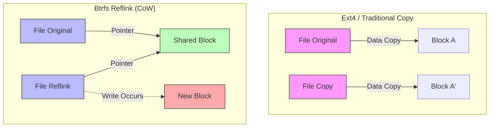
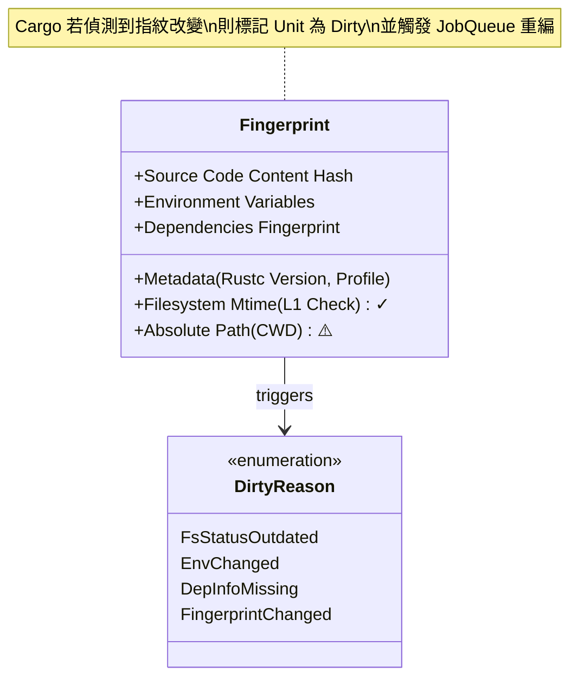
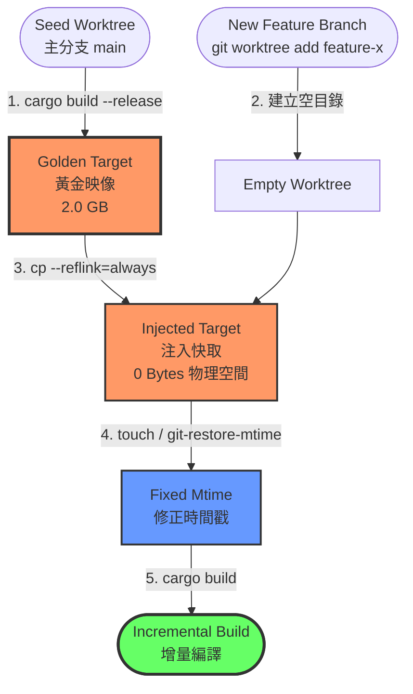
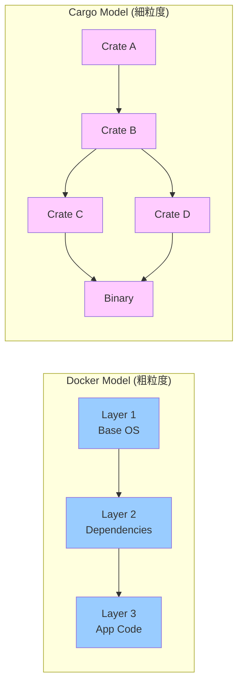
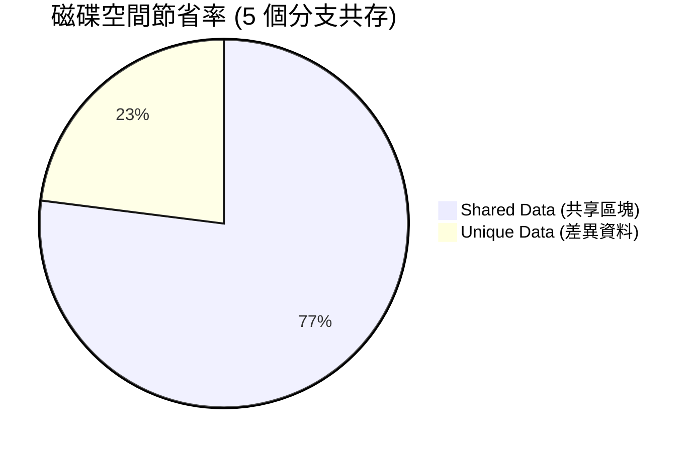
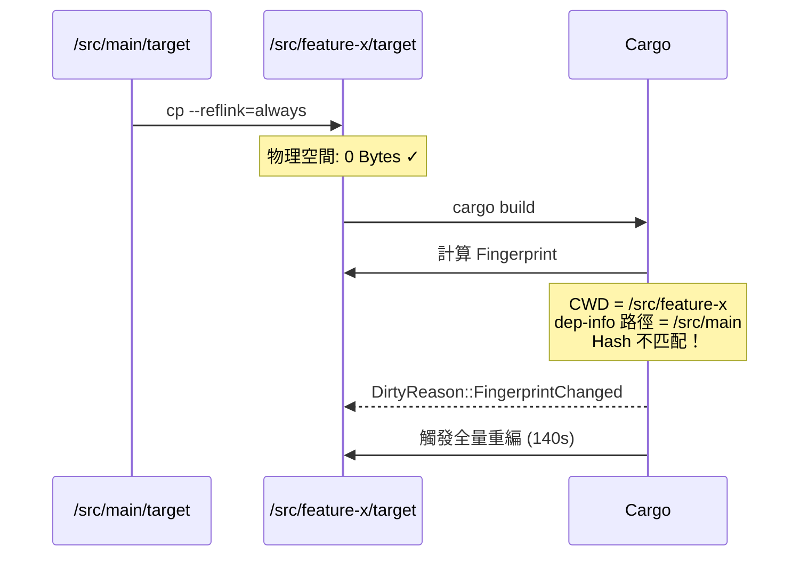
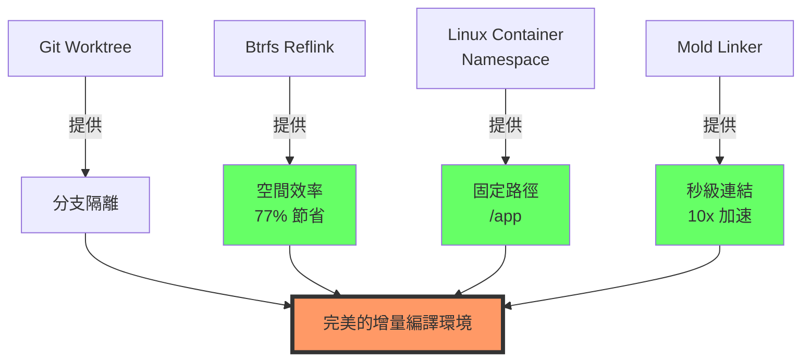

# 運用 Btrfs 寫入時複製機制加速 Rust 建置快取之研究
## A Study on Accelerating Rust Build Caching with Btrfs Copy-on-Write Mechanism

**指導教授：** [教授姓名]  
**學生：** [您的姓名]  
**日期：** 202X / XX / XX

---

## 【左欄：問題與架構】 (Left Column: Context & Mechanism)

### 1. 研究背景與動機 (Background & Motivation)

#### Rust 編譯的挑戰
*   **龐大的編譯產物**：Rust 的單態化（Monomorphization）特性導致 `target/` 目錄體積極大（數十 GB）
*   **冗長的編譯時間**：大型專案編譯可能需要數分鐘甚至數十分鐘

#### 多分支開發困境
*   **單一工作目錄策略**：
    *   切換分支 (`git checkout`) 會改變檔案 `mtime`
    *   導致 Cargo 快取失效，觸發不必要的重編譯
*   **多工作目錄策略 (Git Worktree)**：
    *   每個分支維護獨立的 `target/` 目錄
    *   磁碟空間呈倍數增長，迅速耗盡 SSD

#### 現有方案的侷限
*   **sccache**：不支援增量編譯，且依賴網路傳輸或本地 I/O
*   **Docker Layer Caching**：分層顆粒度太粗，無法對應檔案級快取

#### 研究目標
利用 **Btrfs 檔案系統**的寫入時複製特性，實現：
*   **空間零成本**：多分支共享編譯產物
*   **秒級冷啟動**：瞬間還原編譯環境

---

### 2. 核心技術機制 (Core Mechanisms)

#### (A) Btrfs CoW 機制 vs 傳統複製

*傳統複製需複製實體資料，Btrfs 僅複製指標，達成 O(1) 瞬間複製*

**Reflink 特性：**
*   複製操作僅需修改 Metadata (inode)
*   不複製實體資料區塊
*   寫入時才觸發 Copy-on-Write
*   時間複雜度：O(1)，空間複雜度：初始為 O(0)

---

#### (B) Cargo 指紋機制 (Fingerprint)

*Cargo 決定是否重編的關鍵因素，本研究試圖欺騙 `Mtime`，但受限於 `Absolute Path`*

**雙層新鮮度檢查：**
1.  **Layer 1 (Mtime Check)**：快速但容易被欺騙 ✓
2.  **Layer 2 (Hash Check)**：包含絕對路徑，無法欺騙 ✗

---

### 3. 系統架構：Cargo-CoW (System Architecture)

*自動化流程：將「黃金映像」瞬間注入到新的開發分支*

**關鍵步驟解析：**
1.  **黃金映像建立**：在主分支完成一次完整編譯
2.  **Reflink 注入**：使用 `ioctl_ficlone` 進行毫秒級複製
3.  **Mtime 修復**：修正檔案時間，滿足 Cargo 第一層檢查
4.  **增量編譯**：Cargo 檢測到快取「新鮮」，僅編譯變更部分

---

### 4. 架構演進：從 Docker 到 Reflink

**初期構想（受 Docker Btrfs Driver 啟發）：**
*   模仿 Docker 的分層儲存模型
*   將 Image Layers 對應為 Btrfs Subvolumes

**遇到的問題：顆粒度不匹配 (Granularity Mismatch)**

**問題分析：**
*   Docker Layer 是不可變的檔案系統快照
*   Cargo Crate 是高度動態的編譯單元
*   為每個 Crate 建立 Subvolume：管理成本過高
*   僅為整個 `target` 建立 Snapshot：無法精細重用中間產物

**修正策略：** 轉向輕量級的 `cp --reflink` 方案

---

## 【右欄：實驗與展望】 (Right Column: Results & Future)

### 5. 實驗結果 (Experimental Results)

#### 實驗環境
*   **作業系統**: Arch Linux (Kernel 6.x)
*   **檔案系統**: Btrfs (Mount options: `compress=zstd:3, noatime`)
*   **硬體**: NVMe SSD (PCIe 4.0)
*   **測試專案**:
    *   小型專案：`ripgrep` (純 Rust, 13K LoC)
    *   大型專案：`Zed Editor` (Rust + C++ FFI, 200K+ LoC)

---

#### A. 空間效率 (Space Efficiency)

**測試情境：** 模擬 5 個並行開發分支的實際工作場景

**詳細數據比較：**

| 策略 | 磁碟佔用機制 | 總空間消耗 | 空間節省率 |
| :--- | :--- | :--- | :--- |
| **傳統 Cargo** | 每個專案獨立儲存 | ~10.0 GB | 0% (基準) |
| **Sccache (Local)** | Target + Cache 雙重儲存 | ~12.0 GB | **-20%** (更浪費) |
| **Cargo-CoW (本研究)** | **Reflink 區塊級去重** | **~2.4 GB** | **76%** ✓ |

**關鍵發現：**
*   Sccache 在本地模式下反而佔用更多空間
*   Btrfs + Zstd 壓縮能進一步提升壓縮率
*   結論：**節省高達 77% 的物理儲存空間**

---

#### B. 建置效能 (Build Time Performance)

**場景一：冷啟動 (Cold Start)**

*Reflink 方案顯著縮短了依賴編譯時間*

```mermaid
gantt
    title 冷啟動時間比較 (ripgrep)
    dateFormat s
    axisFormat %Ss
    
    section 傳統 Cargo (4.09s)
    依賴編譯 (Deps)      :a1, 0, 3s
    最終編譯 (Bin)       :a2, after a1, 1.09s
    
    section Reflink 方案 (2.80s)
    環境複製 (Reflink)   :crit, b1, 0, 2.5s
    依賴編譯 (Deps)      :b2, after b1, 0s
    最終編譯 (Bin)       :active, b3, after b1, 0.3s
```

| 專案規模 | 傳統全量編譯 | Reflink 快照還原 | 加速倍率 | 結果判讀 |
| :--- | :--- | :--- | :--- | :--- |
| **ripgrep** (小) | 4.09 s | **2.80 s** | **1.46x** 🚀 | **有效**：成功跳過依賴編譯 |
| **Zed** (大) | 140.8 s | 146.1 s | **0.96x** 🔻 | **失效**：路徑污染導致重編 |

---

**場景二：增量修改 (Incremental Build)**

| 專案規模 | 原生增量編譯 | Reflink + 增量 | 效能落差 | 結果判讀 |
| :--- | :--- | :--- | :--- | :--- |
| **ripgrep** | **0.67 s** | 5.37 s | **慢 8.0x** 🔻 | 固定開銷 (~2.5s) 過大 |

**結論：**
*   ✓ **適用場景**：Clean Build 時間 > 30 秒的專案
*   ✗ **不適用**：頻繁微量修改的 Inner Loop

---

### 6. 關鍵分析 (Key Analysis)

#### 問題：路徑污染之壁 (Path Pollution)

**實驗失敗案例：Zed Editor**

**根本原因：**
1.  **Unit Graph 重建**：Cargo 在新路徑下重新計算所有 Unit 的 Fingerprint
2.  **Hash 不匹配**：由於 CWD (當前工作目錄) 參與了 Fingerprint 計算
3.  **連鎖失效**：底層依賴（如 `libc`, `syn`）因路徑改變被標記為 Dirty，觸發上游重編

**[圖片佔位符]**
> 建議放置 Cargo log 截圖，顯示 `DirtyReason::FsStatusOutdated` 或指紋不匹配的診斷訊息

---

#### 問題：連結器瓶頸 (Linker Bottleneck)

**效能剖析（使用 `cargo build --timings`）：**

**關鍵發現：**
*   連結階段佔據 **40% - 90%** 的增量編譯時間
*   傳統連結器（`ld`, `gold`）無法被 Cargo 快取
*   路徑改變導致連結器必須重新讀取數千個 Object Files

**解決方案：** 整合 **Mold** 高速連結器

---

### 7. 結論與未來展望 (Conclusion & Future Work)

#### 結論

本研究證實了利用 Btrfs Reflink 優化 Rust 開發流程的可行性與侷限性：

**優勢：**
1.  ✓ **極致的空間效率**：節省 77% 磁碟空間
2.  ✓ **完美的增量相容**：不破壞 rustc 原生增量編譯
3.  ✓ **適用於中小型純 Rust 專案**

**侷限：**
1.  ✗ **路徑依賴問題**：大型專案快取失效
2.  ✗ **固定開銷**：不適合微量修改場景
3.  ✗ **連結器瓶頸**：無法加速最終連結階段

---

#### 未來展望：混合式架構

**終極解決方案：四位一體架構**

**具體實施路徑：**

1.  **短期（容器化虛擬路徑）**：
    *   利用 Docker/Bubblewrap 將不同 Worktree 掛載至容器內的 **固定路徑**（如 `/app`）
    *   徹底欺騙 Cargo 的路徑檢查
    *   在宿主機層面保留 Reflink 的儲存優勢

2.  **中期（Mold 連結器整合）**：
    *   解決增量編譯後期的 I/O 與 CPU 瓶頸
    *   實現「Reflink 秒級準備 + Mold 秒級連結」的協同效應

3.  **長期（RFC 3127 追蹤）**：
    *   等待 Rust 官方支援 `--trim-paths` 編譯參數
    *   從編譯器層級移除二進位檔中的絕對路徑
    *   使 Reflink 方案不再依賴容器化

4.  **終極（Reflink-aware Sccache）**：
    *   修改 Sccache 源碼，使其本地後端支援 `ioctl_ficlone`
    *   結合 Sccache 的雜湊管理與 Reflink 的儲存優勢

---

### 參考文獻 (References)

1.  Btrfs Documentation. (n.d.). *Copy on Write (CoW)*. https://btrfs.wiki.kernel.org/
2.  The Cargo Book. (n.d.). *Build Cache & Fingerprinting*.
3.  Rust Internals. (n.d.). *Cargo's Unit Graph and DirtyReason*.
4.  Mozilla. (n.d.). *sccache - Shared Cloud Cache for Rust*.
5.  RFC 3127. (n.d.). *Trim Paths*. Rust RFCs.
6.  Rui Ueyama. (n.d.). *Mold: A Modern Linker*. https://github.com/rui314/mold

---

### 致謝 (Acknowledgements)

感謝指導教授 [教授姓名] 的悉心指導，以及 Rust 社群提供的豐富技術資源。

**聯絡方式：** [您的 Email]